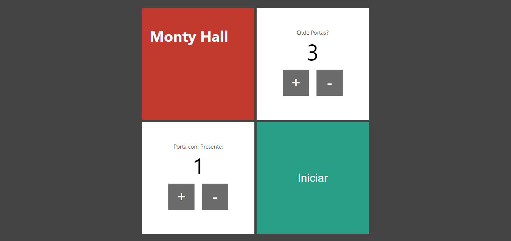
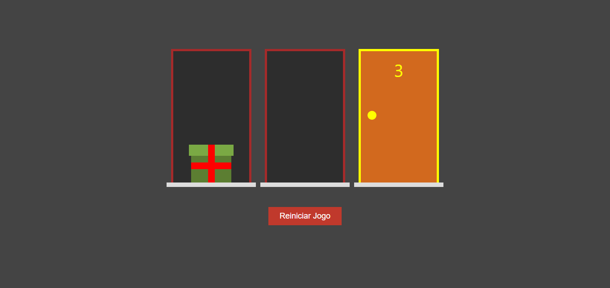

# Monty Hall
Monty Hall, jogo das portas. Escolha a quantidade de portas e uma delas para possuir o presente.




## ✨ Tecnologias
React | Next | Vite | TypeScript

## 💻 Uso
Em seu terminal:
```bash
# Clone o repositório
git clone https://github.com/ViGF/Monty-Hall.git
# Acesse a pasta do projeto
cd "Monty Hall"
# Instale as dependências
yarn add
# Execute a aplicação
yarn run dev
#Agora basta acessar a aplicação
```

## 🏷️ Features para você implementar
- Função de gerar o número da porta com presente aleatoriamente, sem a escolha do usuário.

<div align="center">
  <small>Desenvolvido por Vitório Gomes - Agosto/2022</small>  
</div>
